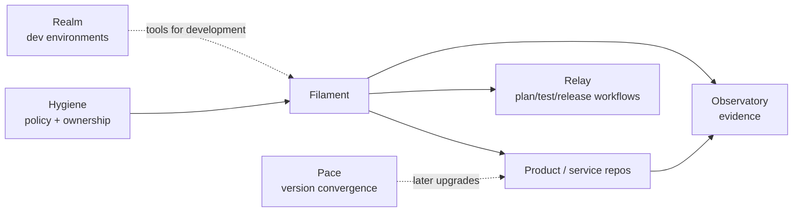

# Filament Architecture

## Boundary

Filament owns **reusable infrastructure-as-code implementation contracts**. Consumers own **why and where infrastructure is deployed**.

## Ecosystem relationships

### Hygiene

Defines organization policy, repository ownership, trust requirements, and architecture constraints. Filament may implement validations derived from those contracts but does not redefine them.

### Relay

Owns reusable CI/CD mechanics. Relay may run Filament validation, plan, release, or consumer integration workflows; Filament owns the IaC semantics those workflows invoke.

### Realm

Owns development/runtime environment projections. Realm may install IaC tooling needed to work with Filament but does not own cloud/resource definitions.

### Product repositories

Own environment selection, budgets, data classification, deployment intent, secret bindings, domain-specific topology, and production state backends. They consume pinned Filament releases.

### Pace and Observatory

Pace may later help consumers upgrade Filament versions. Observatory may display module adoption, conformance, drift evidence, and release health without becoming a state backend.

## Firmament reconciliation

The previously documented deferred `firmament` concept described a future infrastructure-as-code/cloud-infrastructure boundary. The user's clarified intent now assigns reusable IaC to **Filament**. Until Hygiene records a separate durable responsibility for Firmament, no parallel Firmament implementation should be created.

## Initial implementation shape

Do not choose a universal engine yet. The first implementation should prove one bounded capability with one well-supported engine/provider combination, a stable schema, validation, tests, a plan path, release metadata, and a disposable consumer fixture.
