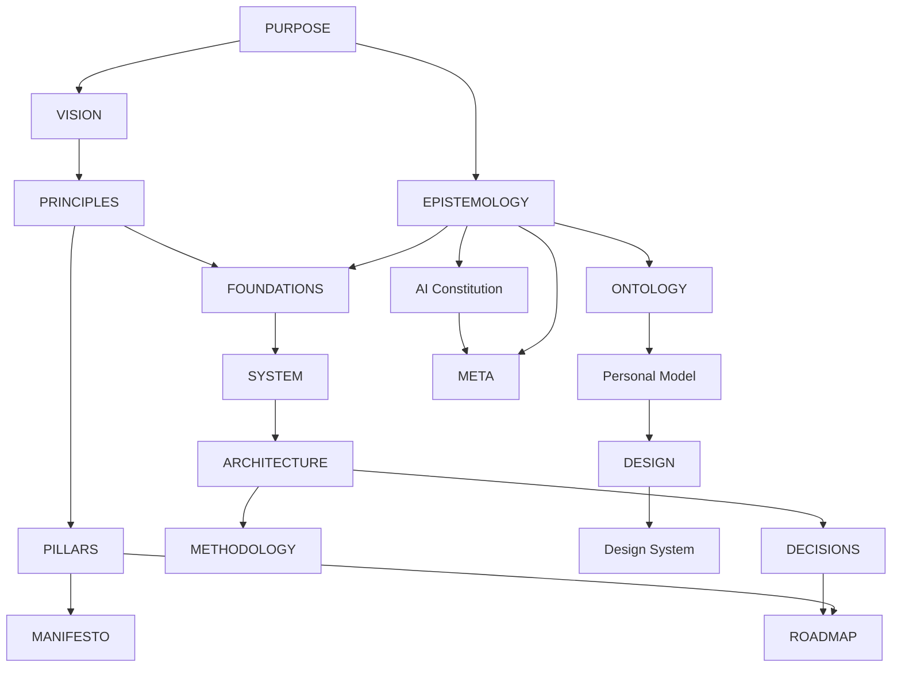

# Filament Meta Architecture

Filament's architecture is an 18-document graph following the organization Aether architecture-document convention.

## Document inventory

| Artifact | Path | Concern |
| --- | --- | --- |
| filament-purpose | [PURPOSE.md](PURPOSE.md) | Why Filament exists |
| filament-vision | [VISION.md](VISION.md) | Desired future |
| filament-principles | [PRINCIPLES.md](PRINCIPLES.md) | Decision heuristics |
| filament-pillars | [PILLARS.md](PILLARS.md) | Strategic capabilities |
| filament-manifesto | [MANIFESTO.md](MANIFESTO.md) | Public commitments |
| filament-epistemology | [EPISTEMOLOGY.md](EPISTEMOLOGY.md) | Evidence and uncertainty |
| filament-ai-constitution | [AI_CONSTITUTION.md](AI_CONSTITUTION.md) | AI authority and limits |
| filament-ontology | [ONTOLOGY.md](ONTOLOGY.md) | Domain language |
| filament-personal-model | [PERSONAL_MODEL.md](PERSONAL_MODEL.md) | Human/operator assumptions |
| filament-foundations | [FOUNDATIONS.md](FOUNDATIONS.md) | Invariants |
| filament-system | [SYSTEM.md](SYSTEM.md) | Logical system |
| filament-architecture | [ARCHITECTURE.md](ARCHITECTURE.md) | Boundaries and relationships |
| filament-methodology | [METHODOLOGY.md](METHODOLOGY.md) | Working method |
| filament-design | [DESIGN.md](DESIGN.md) | Developer/operator experience |
| filament-design-system | [DESIGN_SYSTEM.md](DESIGN_SYSTEM.md) | Shared semantic language |
| filament-decisions | [DECISIONS.md](DECISIONS.md) | Durable decisions |
| filament-roadmap | [ROADMAP.md](ROADMAP.md) | Evolution and v1 gates |
| filament-meta | [META.md](META.md) | Architecture graph/index |

## Relationship graph

## Lifecycle

All documents are provisional until reviewed. Implementation evidence should progressively move specific contracts from proposed architecture into active, versioned behavior. Changes to Filament's durable ownership boundary require synchronized review with Hygiene because they affect cross-repository dependency direction.

## Current uncertainty

The ownership boundary is now sufficiently defined to begin research and a first vertical slice, but the IaC engine, provider set, module packaging format, state-backend support, and first capability remain intentionally undecided.
